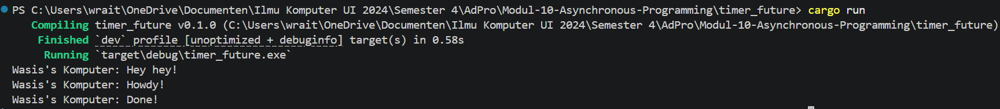
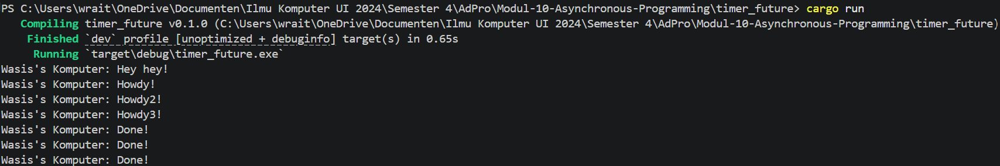
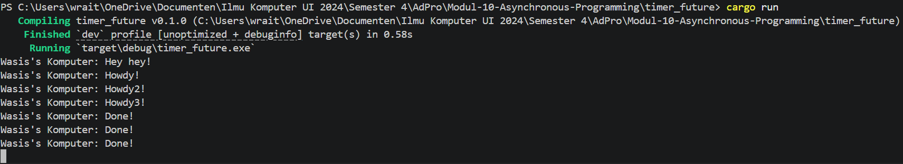
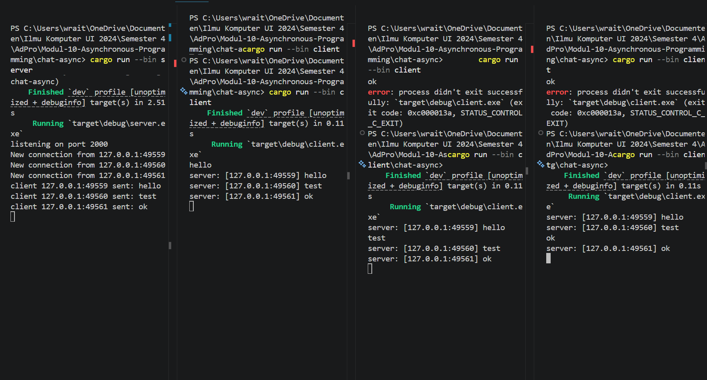
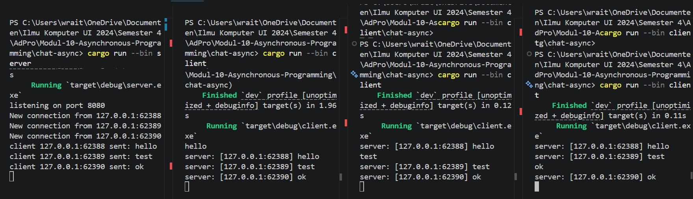

# Modul-10-Asynchronous-Programming

Experiment 1.2

Output `Hey hey` muncul lebih dahulu karena `spawner.spawn(...)` hanya memasukkan future ke dalam antrean, bukan langsung mengeksekusinya. Setelah itu, fungsi `main` masih terus berjalan dan mencetak `Hey hey` sebelum `executor.run()` mulai memproses task yang telah dijadwalkan. Ketika executor mulai berjalan, future di dalam spawner baru dieksekusi, sehingga pesan dari kode async muncul setelahnya.

Experiment 1.3

Gambar 1 menjelaskan mengapa urutan output muncul sebagai: `Hey hey`, `Howdy`, `Howdy2`, `Howdy3`, `Done`, `Done`, `Done`. Setiap pemanggilan `spawner.spawn(...)` mendaftarkan sebuah `Task` secara berurutan ke channel sinkron. Executor kemudian membaca dan mem-poll task satu per satu dalam urutan pendaftaran. Selain itu, panggilan `println!("Hey hey")` terjadi di jalur utama sebelum `executor.run()` dipanggil, sehingga teks tersebut ditampilkan terlebih dahulu.

Gambar 2 menjelaskan mengapa program akan terus menunggu (terlihat seperti infinite loop) jika `drop(spawner)` dihapus. Executor menggunakan `recv()` pada `Receiver` dalam loop; `recv()` hanya mengembalikan `Err` (yang menghentikan loop) bila semua pengirim (`SyncSender`) ditutup. Jika `spawner` tidak di-drop, channel tetap terbuka dan `recv()` akan menunggu pesan baru selamanya, sehingga program tidak keluar. Menutup semua pengirim memungkinkan executor mendeteksi akhir antrean dan berhenti dengan rapi.

Experiment 2.1

Untuk menjalankan program ini, buka dua atau lebih terminal di folder `chat-async`. Pada terminal pertama jalankan server dengan `cargo run --bin server`. Setelah itu, buka terminal lain dan jalankan client dengan `cargo run --bin client`. Jika ingin melihat efek broadcast, jalankan beberapa client sekaligus.

Saat kita mengetik teks di salah satu client lalu menekan Enter, pesan tersebut akan dikirim ke server. Server kemudian mencatat pesan itu di terminal server dan mengirim ulang pesan ke semua client dengan awalan seperti `server: [alamat_client]`. Karena itu, semua client yang sedang tersambung akan melihat pesan yang sama muncul di layar mereka, termasuk client yang mengirim pesan.

Experiment 2.2

Untuk mengubah port menjadi `8080`, saya harus mengubah dua sisi koneksi, yaitu server dan client. Di sisi server, port ditentukan saat `TcpListener::bind("127.0.0.1:8080")` dijalankan di [src/bin/server.rs](chat-async/src/bin/server.rs). Di sisi client, alamat tujuan juga harus sama, yaitu pada `ClientBuilder::from_uri(Uri::from_static("ws://127.0.0.1:8080"))` di [src/bin/client.rs](chat-async/src/bin/client.rs). Jika hanya salah satu yang diubah, client dan server tidak akan saling terhubung karena mereka harus mendengarkan dan terhubung ke port yang sama.

Program tetap berjalan dengan benar setelah port diganti ke `8080` karena logika websocket-nya tidak berubah, hanya alamat koneksinya saja. Protokol websocket juga tetap sama, dan didefinisikan pada skema URL `ws://` di sisi client. Sisi server menggunakan `tokio_websockets::ServerBuilder` untuk menerima koneksi websocket dari socket TCP, jadi keduanya tetap memakai protokol websocket yang sama melalui crate `tokio-websockets`.

